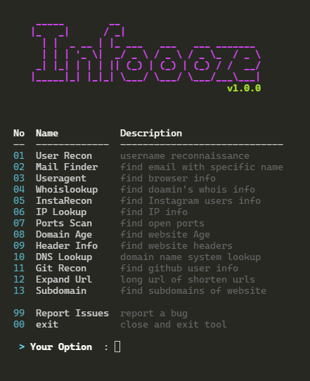
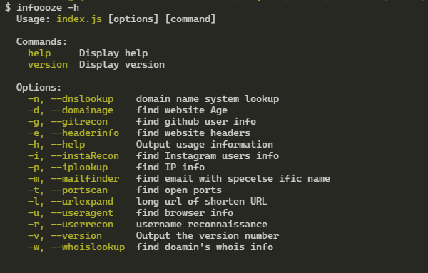
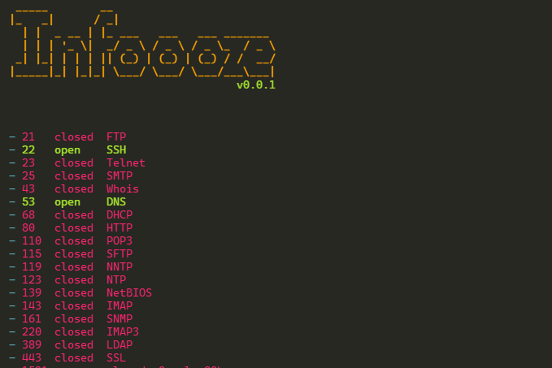
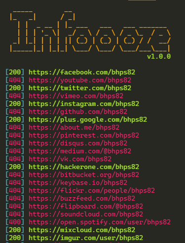
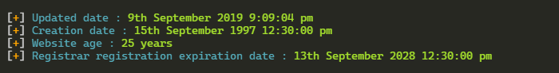

<div id="top"></div>

<!-- PROJECT LOGO -->
<br />
<div align="center">
  <a href="https://github.com/devXprite/infoooze">
    
  </a>

<h2 align="center">Infoooze</h2>

  <p align="center">
    <a href="https://github.com/devXprite/infoooze/issues/new?assignees=&labels=bug&template=bug_report.md&title=">Report Bug</a>
    ·
    <a href="https://github.com/devXprite/infoooze/issues">Request Feature</a>
  </p>

  
  
  
   
<br />
<br />

</div>

<!-- TABLE OF CONTENTS -->

## Table of Content

1. [About Infoooze](#about-infoooze)
   - [Features](#features)
   - [Support](#support)
2. [Getting Started](#getting-started)
   - [Prerequisites](#prerequisites)
   - [Installation on Linux](#getting-started)
     - [Using NPM](#using-npm)
     - [Using GIT](#using-git)
   - [Installation on Android](#getting-started)
   - [Uninstall](#uninstall)
3. [Usage](#usage)
   - [Options](#options)
   - [Examples](#examples)
4. [Run in Gitpod](#run-with-gitpod)
5. [Contributing](#contributing)
6. [License](#license)
7. [Contact](#contact)

<!-- ABOUT THE PROJECT -->

## About Infoooze

Infoooze is a New OSINT tool in NodeJs. It helps you to quickly find information about "something" effectively. Its a Global package so that you can easily use it independently from any directory. All you need is to input info such as website, ip, username... and it will take take care of rest. 

### Features

1.  Insta Recon
2.  Subdomain Scanner
3.  Ports Scan
4.  User Recon
5.  Mail finder
6.  URL Scanner
7.  Exif metadata extract
8.  Whois Lookup
9.  IP Lookup
10. Header Info
11. Domain Age
12. DNS Lookup
13. UserAgent Lookup
14. Git Recon
15. Expand URL
16. Instagram DP Viwer
17. Save Results to file

### Support

| Linux | Termux | Windows | Mac |
| ----- | ------ | ------- | --- |
| ✔     | ✔      | ✔       | ❔   |

✔ Tested  
❔ - Not tested

<!-- GETTING STARTED -->

## Getting Started

### Prerequisites

You need **NodeJs** 10 or later to run this tool. You can install NodeJs

- On Linux
  ```sh
  sudo apt-get install nodejs
  ```
  > Although there is no need to install NodeJs on Kali Linux, as its packages are already present in Kali Linux.
- On Termux
  ```sh
  pkg install nodejs-lts 
  ```

### Installation on [Linux](https://wikipedia.org/wiki/Linux)

- #### Using NPM

  ```sh
  sudo npm install infoooze -g -s
  ```

- #### Using GIT

  ```sh
  sudo npm install git+ssh://git@github.com/devXprite/infoooze.git -g
  ```


### Installation on [Termux](https://github.com/termux/termux-app#f-droid)

```sh
 npm install -g -s infoooze
```

### Install locally

```bash
git clone https://github.com/devXprite/infoooze.git
cd infoooze
npm install
node index.js
```

### Uninstall

```sh
npm remove infoooze -g
```

<p align="right">(<a href="#top">back to top</a>)</p>

<!-- USAGE EXAMPLES -->

## Usage

After installing you can run tool by just typing `infoooze`.
```sh
infoooze [options] [value]
```
> You can also use **infooze** & **infoze**.


### Options:

| Short Form | Long Form        | Description                       |
| :--------- | :--------------- | :-------------------------------- |
| -n         | --dnslookup      | domain name system lookup         |
| -e         | --headerinfo     | find website headers              |
| -p         | --iplookup       | find IP info                      |
| -a         | --webscan        | analyze suspicious URLs           |
| -m         | --mailfinder     | find email with specific name     |
| -t         | --portscan       | find open ports                   |
| -x         | --exif           | extracts Exif metadata from image |
| -r         | --userrecon      | username reconnaissance           |
| -w         | --whoislookup    | find domain's whois info          |
| -d         | --domainAge      | find website Age                  |
| -s         | --subdomain      | find subdomains of website        |
| -h         | --help           | Output usage information          |
| -c         | --subdomainrecon | find subdomains passively         |
| -g         | --gitrecon       | find github user info             |
| -i         | --instaRecon     | find Instagram users info         |
| -u         | --useragent      | find browser info                 |
| -l         | --urlexpand      | long url of shorten URL           |
| -v         | --version        | Output the version number         |

### Examples

- To Update Tool:
  ```sh
  npm update -g infoooze
  ```
- To get list of all the basic options use -h :
  ```sh
  infoooze -h
  ```
- To Get Instagram User Info:
  ```sh
  infoooze -i instagam
  ```
- To Get Domain's Whois Information:
  ```sh
  infoooze -w google.com
  ```
- To Get Subdomains of website:
  ```sh
  infoooze -s google.com
  ```
- To Get IP Information:
  ```sh
  infoooze -p 8.8.8.8
  ```
<p align="right">(<a href="#top">back to top</a>)</p>

<!-- GitPod -->

## Run with Gitpod

Click this button to run your project on Gitpod which comes with pre-configured environment you need.

[](https://gitpod.io/#https://github.com/devXprite/infoooze)


<!-- ScreenShots -->

<h2> Screenshots</h2>
 
<br>

 





<p align="right">(<a href="#top">back to top</a>)</p>
<hr>

<!-- CONTRIBUTING -->
## Contributing

Contributions are what make the open source community such an amazing place to learn, inspire, and create. Any contributions you make are **greatly appreciated**.

If you have a suggestion that would make this better, please fork the repo and create a pull request. You can also simply open an issue with the tag "enhancement".
Don't forget to give the project a star! Thanks again!

1. Fork the Project
2. Create your Branch 
3. Commit your Changes 
4. Push to the Branch 
5. Open a Pull Request
 
<p align="right">(<a href="#top">back to top</a>)</p>

<!-- LICENSE -->

## Supporters

### Stargazers:
[![Stargazers repo roster for @devXprite/infoooze][stangers-img-url]](https://github.com/devXprite/infoooze/stargazers)  

### Forkers
[![Forkers repo roster for @devXprite/infoooze][forker-img-url]](https://github.com/devXprite/infoooze/network/members)

<p align="right">(<a href="#top">back to top</a>)</p>

## Contributors
Thank you so much all for spending your time to improve Infoooze.  
  
[](https://github.com/devXprite/infoooze/graphs/contributors)

## License

Distributed under the MIT License. See `LICENSE.txt` for more information.


<!-- MARKDOWN LINKS & IMAGES -->
<!-- https://www.markdownguide.org/basic-syntax/#reference-style-links -->

[contributors-shield]: https://img.shields.io/github/contributors/devXprite/infoooze.svg?style=for-the-badge
[contributors-url]: https://github.com/devXprite/infoooze/graphs/contributors
[forks-shield]: https://img.shields.io/github/forks/devXprite/infoooze.svg?style=for-the-badge
[forks-url]: https://github.com/devXprite/infoooze/network/members
[stars-shield]: https://img.shields.io/github/stars/devXprite/infoooze.svg?style=for-the-badge
[stars-url]: https://github.com/devXprite/infoooze/stargazers
[issues-shield]: https://img.shields.io/github/issues/devXprite/infoooze.svg?style=for-the-badge
[issues-url]: https://github.com/devXprite/infoooze/issues
[license-shield]: https://img.shields.io/github/license/devXprite/infoooze.svg?style=for-the-badge
[license-url]: https://github.com/devXprite/infoooze/blob/master/LICENSE.txt
[linkedin-shield]: https://img.shields.io/badge/-LinkedIn-black.svg?style=for-the-badge&logo=linkedin&colorB=555
[linkedin-url]: https://linkedin.com/in/devXprite
[stangers-img-url]: https://reporoster.com/stars/dark/devXprite/infoooze
[forker-img-url]: https://reporoster.com/forks/dark/devXprite/infoooze
[product-screenshot]: images/screenshot.png
[downloads]: https://img.shields.io/npm/dw/infoooze?style=for-the-badge
[npm]: https://www.npmjs.com/package/infoooze
[version]: https://img.shields.io/npm/v/infoooze?style=for-the-badge
[quality]: https://img.shields.io/npms-io/quality-score/infoooze?style=for-the-badge
